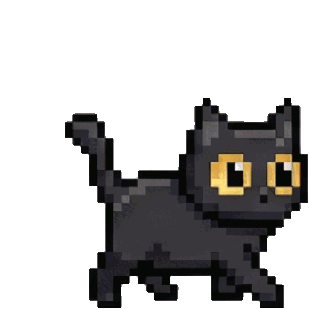
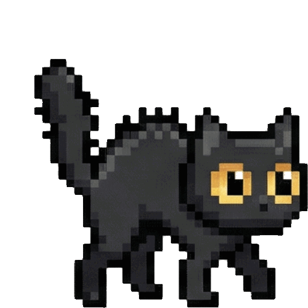
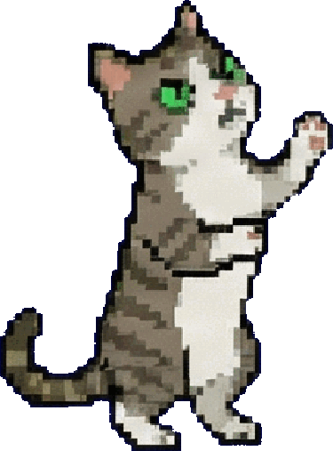

# Miaou

A tiny pixel cat that lives on your desktop and alerts you when [Claude Code](https://docs.anthropic.com/en/docs/claude-code) or [Codex](https://openai.com/index/codex/) needs your attention.

<p align="center">
  
  &nbsp;&nbsp;&nbsp;&nbsp;
  
  &nbsp;&nbsp;&nbsp;&nbsp;
  
  &nbsp;&nbsp;&nbsp;&nbsp;
  
</p>

## Why?

When you run AI coding agents in tmux sessions, you lose track of which one needs input. Miaou fixes that: the cat bounces when a session needs you, and clicking it takes you straight there.

Between notifications, it just hangs out on your screen — walking, sleeping, being a cat.

## Install

Requires macOS 13+ and Swift 5.9+.

```bash
git clone https://github.com/Soupinou/miaou.git
cd miaou
./install.sh
```

This will:
- Build the app from source and install it to `/Applications/`
- Configure Claude Code hooks in `~/.claude/settings.json` (backs up first)
- Add the `miaou` CLI to your PATH
- Launch the cat

That's it. The cat is now on your screen.

## How it works

```
Claude Code finishes / needs permission
        |
        v
Hook fires -> miaou://notify -> Cat bounces!
        |
        v
Click the cat (or press Option twice) -> tmux switches to the right pane
```

The hook script detects your active tmux session and only fires when you're not already looking at the right pane. It supports **Alacritty**, **Ghostty**, **iTerm2**, **Kitty**, **Terminal**, **Warp**, and **WezTerm**.

## CLI

```
miaou install     First-time setup (build, install, configure hooks)
miaou update      Rebuild from source, replace app, restart
miaou start       Launch the app
miaou stop        Quit the app
miaou uninstall   Remove everything cleanly
```

## Customization

Right-click the menu bar icon to configure:

| Setting | Options |
|---------|---------|
| **Pet** | Soupinou, Chawy, Pistache, Chalom, Sundae, Lou |
| **Size** | 0.5x to 2x |
| **Speed** | 0.5x to 2x |
| **Activity** | 10% (sleepy) to 90% (hyper), default 40% |
| **Roaming radius** | Small, Medium, Large, Extra Large, Unlimited |
| **Terminal** | Alacritty, Ghostty, iTerm2, Kitty, Terminal, Warp, WezTerm |
| **Hotkey** | Double-tap Option (enabled by default) |
| **Env tooltip** | Show session name above the cat on notification |
| **Launch at Login** | Auto-start on login |

You can also drag and drop the cat anywhere on your screen (or to another monitor). It remembers where you put it and roams around that spot.

## Adding your own pet

Sprites live in `Miaou/Resources/<pet_name>/` as PNGs. Each pet needs 3 animations with 6 frames each:

```
00_petname_walk.png  ...  05_petname_walk.png
00_petname_sleep.png
00_petname_notification.png  ...  05_petname_notification.png
```

Then add your pet to the `CatType.allCats` array in `Miaou/Models/CatState.swift` and run `miaou update`.

PRs with new pets are welcome!

## Codex support

A separate hook script is included for OpenAI Codex. See `scripts/miaou-codex-notify.sh` and configure it in your Codex settings.

## Technical details

<details>
<summary>Architecture</summary>

The app is a borderless, non-activating floating window that never steals focus.

**State machine** — The cat has 4 states:
- **idle** — Transitional
- **walking** — Moving toward a random target within roaming radius
- **sleeping** — Stationary for 8-20 seconds
- **attentionNeeded** — Bouncing, waiting for click

**CPU optimization:**
- Movement timer (60fps) only runs while walking or bouncing
- Sprite animation runs at 3fps (pixel art doesn't need more)
- "Hide Cat" stops all timers (0 CPU)
- Lightweight: ~15-20MB memory

**Security:** tmux targets from URLs are validated against `^[A-Za-z0-9_.:-]+$` before shell execution.

</details>

<details>
<summary>Project structure</summary>

```
scripts/
  cli.sh                     CLI (install/update/start/stop/uninstall)
  bundle-app.sh              Build .app bundle from Swift source
  claude-code-notify.sh      Hook script installed to ~/.claude/
  miaou-codex-notify.sh      Hook script for OpenAI Codex

Miaou/
  App/
    MiaouApp.swift            App entry point
    AppDelegate.swift         URL handling, status bar, hotkey
  Views/
    CatWindowController.swift Window management, tooltip, tmux switching
    CatView.swift             Rendering and interaction
  Models/
    CatState.swift            State definitions, pet registry
    CatPreferences.swift      User preferences (UserDefaults)
    RoamingBehavior.swift     Movement logic
  Animation/
    CatAnimator.swift         Frame animation
    SpriteManager.swift       Asset loading and caching
  Resources/                  Pet sprites and status bar icons
```

</details>

## Credits

Originally created as [DustHiveCat](https://github.com/dust-tt/dust/tree/main/x/daph/dust-hive-cat) at [Dust](https://dust.tt). Inspired by [Dockitty](https://www.dockitty.app/).

## License

MIT
